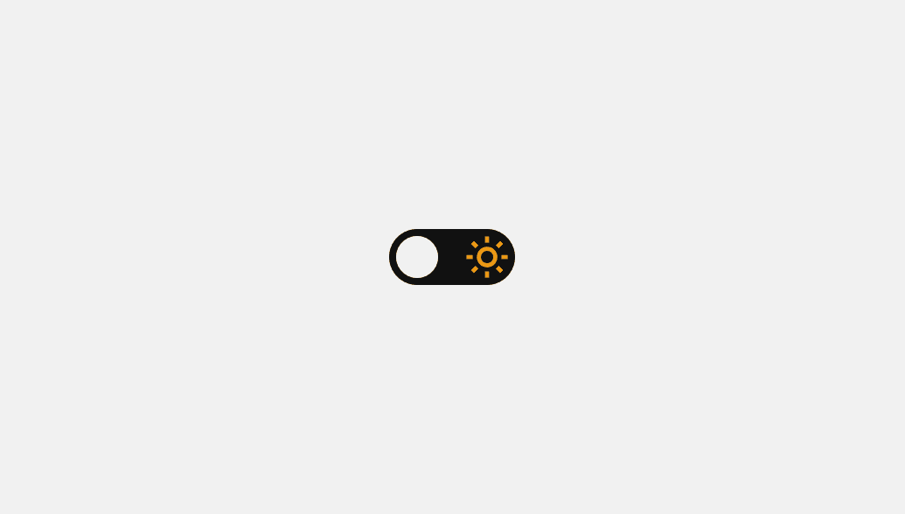

# Theme switcher

## About

An light/dark theme switcher.

## Run

Install [Live Server extension](https://marketplace.visualstudio.com/items?itemName=ritwickdey.LiveServer), right click on `index.html` file and then click on `Open with Live Server`.

### Status

Done ✅

## License

[MIT](/LICENSE)
